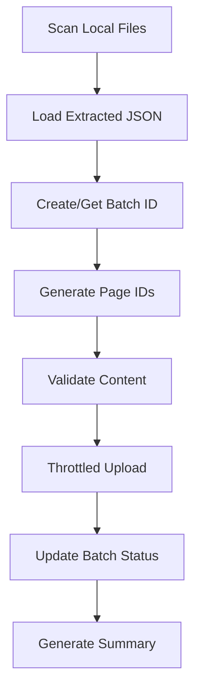

# 📤 Gulp Upload Module Specification

## 🎯 **Purpose**

Upload extracted page content from local gulp to Cloudflare KV storage with proper batching, throttling, and error handling.

## 🔧 **Module Structure**

```
gulp/tasks/cloudflare/
├── upload.js              # Main upload orchestrator
├── batch-manager.js       # Batch creation and tracking
├── throttle-upload.js     # Concurrency control
├── kv-client.js          # Cloudflare KV wrapper
└── utils/
    ├── id-generator.js    # Generate page/batch IDs
    └── validators.js      # Validate data before upload
```

## 📊 **Upload Flow**



## 🛠️ **Implementation**

### **Main Upload Command**
```bash
# Upload with new batch
gulp nimbus:upload --folder=.nimbus/maps --limit=100

# Upload to existing batch
gulp nimbus:upload --folder=.nimbus/maps --batch=batch_20240902_134500

# Upload with custom concurrency
gulp nimbus:upload --folder=.nimbus/maps --concurrency=10 --delay=100
```

### **Core Upload Module**
```javascript
// gulp/tasks/cloudflare/upload.js
const pLimit = require('p-limit');
const { createBatch, updateBatchStatus } = require('./batch-manager');
const { uploadPage } = require('./throttle-upload');
const { generatePageId } = require('./utils/id-generator');
const { validatePageData } = require('./utils/validators');

module.exports = {
  async run(options) {
    const {
      folder = '.nimbus/maps',
      limit = 100,
      batch: existingBatchId,
      concurrency = 5,
      delay = 200
    } = options;

    // Load project config
    const projectConfig = await this.loadProjectConfig();
    if (!projectConfig) {
      throw new Error('No project initialized. Run: gulp nimbus:project:init');
    }

    // Create or get batch
    const batchId = existingBatchId || await createBatch(projectConfig.project_id);
    console.log(`📦 Using batch: ${batchId}`);

    // Discover extracted files
    const files = await this.discoverFiles(folder, limit);
    console.log(`📁 Found ${files.length} files to upload`);

    // Set up throttling
    const limiter = pLimit(concurrency);
    const uploadResults = [];

    // Upload with progress tracking
    console.log(`⬆️  Uploading with concurrency: ${concurrency}`);
    const uploadPromises = files.map((file, index) => 
      limiter(async () => {
        try {
          // Add delay between uploads
          if (index > 0) await this.delay(delay);
          
          const result = await this.uploadFile(file, projectConfig, batchId);
          console.log(`✅ [${index + 1}/${files.length}] Uploaded: ${result.page_id}`);
          uploadResults.push(result);
          
          return result;
        } catch (error) {
          console.error(`❌ [${index + 1}/${files.length}] Failed: ${file}`, error.message);
          uploadResults.push({ file, error: error.message });
          throw error;
        }
      })
    );

    // Wait for all uploads
    await Promise.allSettled(uploadPromises);

    // Update batch status
    await updateBatchStatus(projectConfig.project_id, batchId, uploadResults);

    // Generate summary
    const summary = this.generateSummary(uploadResults);
    console.log('\n📊 Upload Summary:');
    console.log(`   ✅ Successful: ${summary.successful}`);
    console.log(`   ❌ Failed: ${summary.failed}`);
    console.log(`   📦 Batch ID: ${batchId}`);

    return { batchId, summary };
  },

  async uploadFile(filePath, projectConfig, batchId) {
    // Load extracted content
    const content = await fs.readJson(filePath);
    
    // Generate page ID
    const pageId = generatePageId(projectConfig.project_id, content.path);
    
    // Prepare page data
    const pageData = {
      page_id: pageId,
      project_id: projectConfig.project_id,
      batch_id: batchId,
      source_path: content.path,
      uploaded: new Date().toISOString(),
      extraction: {
        engine: content.engine,
        main_selector: content.main_selector,
        head: content.head,
        dimensions: content.dimensions,
        above_fold_blocks: content.above_fold_blocks,
        rest_of_page_blocks: content.rest_of_page_blocks,
        selector_map: content.selector_map
      }
    };

    // Validate before upload
    validatePageData(pageData);

    // Upload to Cloudflare
    await uploadPage(projectConfig, pageId, pageData);

    return { page_id: pageId, success: true };
  }
};
```

### **Batch Manager**
```javascript
// gulp/tasks/cloudflare/batch-manager.js
module.exports = {
  async createBatch(projectId) {
    const batchId = `batch_${this.getTimestamp()}`;
    
    const batchData = {
      batch_id: batchId,
      project_id: projectId,
      created: new Date().toISOString(),
      page_count: 0,
      status: 'uploading',
      pages: {},
      summary: {
        completed: 0,
        failed: 0,
        pending: 0
      }
    };

    await kvClient.put(
      `batch:${projectId}:${batchId}`,
      JSON.stringify(batchData)
    );

    return batchId;
  },

  async updateBatchStatus(projectId, batchId, uploadResults) {
    const batch = await kvClient.get(`batch:${projectId}:${batchId}`, 'json');
    
    // Update page statuses
    uploadResults.forEach(result => {
      if (result.success) {
        batch.pages[result.page_id] = {
          status: 'uploaded',
          uploaded: new Date().toISOString()
        };
        batch.page_count++;
      }
    });

    // Update summary
    batch.summary.pending = batch.page_count;
    batch.status = 'queued';

    await kvClient.put(
      `batch:${projectId}:${batchId}`,
      JSON.stringify(batch)
    );
  },

  getTimestamp() {
    const now = new Date();
    return now.toISOString()
      .replace(/[-:]/g, '')
      .replace('T', '_')
      .slice(0, 15);
  }
};
```

### **Throttled Upload**
```javascript
// gulp/tasks/cloudflare/throttle-upload.js
const { kvClient } = require('./kv-client');

module.exports = {
  async uploadPage(projectConfig, pageId, pageData) {
    try {
      // Upload page data
      await kvClient.put(
        `page:${projectConfig.project_id}:${pageId}`,
        JSON.stringify(pageData),
        {
          metadata: {
            batch_id: pageData.batch_id,
            uploaded: pageData.uploaded
          }
        }
      );

      // Set initial status
      await kvClient.put(
        `status:${projectConfig.project_id}:${pageId}`,
        JSON.stringify({
          status: 'uploaded',
          batch_id: pageData.batch_id,
          updated: new Date().toISOString()
        })
      );

      // Add to queue
      await this.addToQueue(projectConfig.project_id, pageId, pageData.batch_id);

      return { success: true };
    } catch (error) {
      console.error(`Upload failed for ${pageId}:`, error);
      throw error;
    }
  },

  async addToQueue(projectId, pageId, batchId) {
    const queue = await kvClient.get(`queue:${projectId}`, 'json') || { items: [] };
    
    queue.items.push({
      page_id: pageId,
      batch_id: batchId,
      priority: 5,  // Default priority
      queued_at: new Date().toISOString(),
      attempts: 0
    });

    await kvClient.put(
      `queue:${projectId}`,
      JSON.stringify(queue)
    );
  }
};
```

### **KV Client Wrapper**
```javascript
// gulp/tasks/cloudflare/kv-client.js
class KVClient {
  constructor(config) {
    this.accountId = config.cloudflare.account_id;
    this.apiKey = config.api_key;
    this.workerUrl = config.cloudflare.worker_url;
  }

  async put(key, value, options = {}) {
    const response = await fetch(`${this.workerUrl}/kv/${key}`, {
      method: 'PUT',
      headers: {
        'Authorization': `Bearer ${this.apiKey}`,
        'Content-Type': 'application/json'
      },
      body: JSON.stringify({ value, options })
    });

    if (!response.ok) {
      throw new Error(`KV PUT failed: ${response.statusText}`);
    }

    return response.json();
  }

  async get(key, type = 'text') {
    const response = await fetch(`${this.workerUrl}/kv/${key}`, {
      headers: {
        'Authorization': `Bearer ${this.apiKey}`
      }
    });

    if (!response.ok) {
      if (response.status === 404) return null;
      throw new Error(`KV GET failed: ${response.statusText}`);
    }

    return type === 'json' ? response.json() : response.text();
  }
}

module.exports = { kvClient: null, initKVClient };

function initKVClient(config) {
  module.exports.kvClient = new KVClient(config);
}
```

## 🎯 **Error Handling**

### **Retry Logic**
```javascript
async function uploadWithRetry(uploadFn, maxRetries = 3) {
  for (let attempt = 1; attempt <= maxRetries; attempt++) {
    try {
      return await uploadFn();
    } catch (error) {
      if (attempt === maxRetries) throw error;
      
      console.log(`⚠️  Retry ${attempt}/${maxRetries} after error:`, error.message);
      await delay(1000 * attempt);  // Exponential backoff
    }
  }
}
```

### **Validation Rules**
```javascript
function validatePageData(pageData) {
  const required = ['page_id', 'project_id', 'batch_id', 'source_path', 'extraction'];
  
  for (const field of required) {
    if (!pageData[field]) {
      throw new Error(`Missing required field: ${field}`);
    }
  }

  if (!pageData.extraction.head?.title) {
    throw new Error('Page must have a title');
  }

  if (!Array.isArray(pageData.extraction.above_fold_blocks)) {
    throw new Error('above_fold_blocks must be an array');
  }
}
```

## 📊 **Progress Tracking**

### **Console Output**
```
📦 Using batch: batch_20240902_134500
📁 Found 100 files to upload
⬆️  Uploading with concurrency: 5

✅ [1/100] Uploaded: page_abc123
✅ [2/100] Uploaded: page_def456
❌ [3/100] Failed: .nimbus/maps/broken.json - Invalid JSON
✅ [4/100] Uploaded: page_ghi789
...

📊 Upload Summary:
   ✅ Successful: 98
   ❌ Failed: 2
   📦 Batch ID: batch_20240902_134500
```

## ✅ **Success Criteria**

- [ ] Upload extracted content to Cloudflare KV
- [ ] Support batch creation and tracking
- [ ] Implement concurrency control (default: 5)
- [ ] Add configurable delay between uploads
- [ ] Validate data before upload
- [ ] Handle errors gracefully with retries
- [ ] Track upload progress and summary
- [ ] Queue pages for processing
- [ ] Update batch and page status
