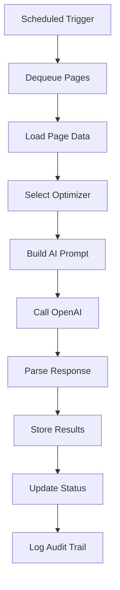

# 🚀 Cloudflare Worker Executor Specification

## 🎯 **Purpose**

Execute AI optimization workflows in Cloudflare Workers, processing pages from the queue with the existing AI logic from `progressive-optimizer.js`.

## 🏗️ **Worker Architecture**

```
worker/
├── index.js                    # Main worker entry point
├── scheduled.js                # Cron-triggered executor
├── workflow-executor.js        # Core AI workflow logic
├── ai-optimizers/
│   ├── meta-optimizer.js       # Title/description optimization
│   ├── above-fold-optimizer.js # Hero section optimization
│   └── full-page-optimizer.js  # Complete page optimization
├── utils/
│   ├── ai-client.js           # OpenAI API wrapper
│   ├── prompt-builder.js      # Build AI prompts
│   └── response-parser.js     # Parse AI responses
└── lib/
    ├── kv-manager.js          # KV operations
    ├── queue-manager.js       # Queue processing
    └── audit-logger.js        # Logging system
```

## 🔄 **Execution Flow**



## 🛠️ **Implementation**

### **Main Worker Entry**
```javascript
// worker/index.js
import { handleScheduled } from './scheduled';
import { handleRequest } from './api-handler';

export default {
  async fetch(request, env, ctx) {
    return handleRequest(request, env, ctx);
  },

  async scheduled(event, env, ctx) {
    ctx.waitUntil(handleScheduled(event, env));
  }
};
```

### **Scheduled Executor**
```javascript
// worker/scheduled.js
import { QueueManager } from './lib/queue-manager';
import { WorkflowExecutor } from './workflow-executor';
import { AuditLogger } from './lib/audit-logger';

export async function handleScheduled(event, env) {
  const queue = new QueueManager(env);
  const executor = new WorkflowExecutor(env);
  const logger = new AuditLogger(env);

  // Process up to 10 pages per execution
  const MAX_PAGES_PER_RUN = env.MAX_PAGES_PER_RUN || 10;
  
  try {
    // Get all project queues
    const projects = await queue.getActiveProjects();
    
    for (const projectId of projects) {
      const items = await queue.dequeue(projectId, MAX_PAGES_PER_RUN);
      
      if (items.length === 0) continue;
      
      console.log(`Processing ${items.length} pages for project ${projectId}`);
      
      // Process pages in parallel (with limit)
      const results = await Promise.allSettled(
        items.map(item => processPage(item, executor, logger))
      );
      
      // Update queue based on results
      await queue.updateResults(projectId, results);
    }
  } catch (error) {
    console.error('Scheduled executor error:', error);
    await logger.logError('scheduled_executor', error);
  }
}

async function processPage(queueItem, executor, logger) {
  const { page_id, batch_id, project_id } = queueItem;
  
  try {
    await logger.log(project_id, page_id, 'info', 'processing_started', {
      batch_id,
      attempt: queueItem.attempts + 1
    });
    
    const result = await executor.execute(project_id, page_id, batch_id);
    
    await logger.log(project_id, page_id, 'info', 'processing_completed', {
      batch_id,
      changes: result.changes,
      confidence: result.confidence
    });
    
    return { success: true, page_id, result };
  } catch (error) {
    await logger.log(project_id, page_id, 'error', 'processing_failed', {
      batch_id,
      error: error.message
    });
    
    throw error;
  }
}
```

### **Workflow Executor (Migrated from progressive-optimizer.js)**
```javascript
// worker/workflow-executor.js
import { MetaOptimizer } from './ai-optimizers/meta-optimizer';
import { AboveFoldOptimizer } from './ai-optimizers/above-fold-optimizer';
import { FullPageOptimizer } from './ai-optimizers/full-page-optimizer';

export class WorkflowExecutor {
  constructor(env) {
    this.env = env;
    this.kv = {
      pages: env.NIMBUS_PAGES,
      status: env.NIMBUS_STATUS,
      projects: env.NIMBUS_PROJECTS
    };
  }

  async execute(projectId, pageId, batchId) {
    // Update status to processing
    await this.updateStatus(projectId, pageId, 'processing');
    
    try {
      // Load page data
      const pageData = await this.loadPageData(projectId, pageId);
      if (!pageData) throw new Error('Page not found');
      
      // Load project settings
      const project = await this.loadProject(projectId);
      
      // Determine optimization tier based on project settings
      const tier = project.settings.optimization_tier || 'full';
      
      // Execute appropriate optimizer
      let result;
      switch (tier) {
        case 'meta':
          result = await this.executeMetaOnly(pageData, project);
          break;
        case 'above-fold':
          result = await this.executeAboveFold(pageData, project);
          break;
        case 'full':
        default:
          result = await this.executeFullPage(pageData, project);
          break;
      }
      
      // Store results
      await this.storeResults(projectId, pageId, result);
      
      // Update status
      await this.updateStatus(projectId, pageId, 'done', result);
      
      return result;
    } catch (error) {
      await this.updateStatus(projectId, pageId, 'failed', { error: error.message });
      throw error;
    }
  }

  async executeMetaOnly(pageData, project) {
    const optimizer = new MetaOptimizer(this.env);
    
    // Extract current meta
    const currentMeta = {
      title: pageData.extraction.head.title,
      description: pageData.extraction.head.metaDescription
    };
    
    // Add context from dimensions
    const context = {
      dimensions: pageData.extraction.dimensions,
      tone: project.settings.tone,
      business: project.metadata
    };
    
    // Optimize
    const optimized = await optimizer.optimize(currentMeta, context);
    
    return {
      type: 'meta',
      changes: 2,  // Title + description
      confidence: optimized.confidence,
      optimizations: {
        head: {
          title: optimized.title,
          metaDescription: optimized.description
        }
      }
    };
  }

  async executeAboveFold(pageData, project) {
    const optimizer = new AboveFoldOptimizer(this.env);
    
    // Get above-fold blocks
    const blocks = pageData.extraction.above_fold_blocks;
    
    // Add context
    const context = {
      dimensions: pageData.extraction.dimensions,
      tone: project.settings.tone,
      metadata: pageData.extraction.head
    };
    
    // Optimize blocks
    const optimizedBlocks = await optimizer.optimize(blocks, context);
    
    // Also optimize meta
    const metaResult = await this.executeMetaOnly(pageData, project);
    
    return {
      type: 'above-fold',
      changes: optimizedBlocks.filter(b => b.optimized_content).length + 2,
      confidence: (optimizedBlocks.confidence + metaResult.confidence) / 2,
      optimizations: {
        head: metaResult.optimizations.head,
        above_fold_blocks: optimizedBlocks.blocks
      }
    };
  }

  async executeFullPage(pageData, project) {
    const optimizer = new FullPageOptimizer(this.env);
    
    // Get all blocks
    const allBlocks = [
      ...pageData.extraction.above_fold_blocks,
      ...pageData.extraction.rest_of_page_blocks
    ];
    
    // Add full context
    const context = {
      dimensions: pageData.extraction.dimensions,
      tone: project.settings.tone,
      metadata: pageData.extraction.head,
      structure: {
        above_fold_count: pageData.extraction.above_fold_blocks.length,
        total_blocks: allBlocks.length
      }
    };
    
    // Optimize everything
    const optimizedBlocks = await optimizer.optimize(allBlocks, context);
    
    // Also optimize meta
    const metaResult = await this.executeMetaOnly(pageData, project);
    
    return {
      type: 'full-page',
      changes: optimizedBlocks.filter(b => b.optimized_content).length + 2,
      confidence: (optimizedBlocks.confidence + metaResult.confidence) / 2,
      optimizations: {
        head: metaResult.optimizations.head,
        blocks: optimizedBlocks.blocks
      }
    };
  }

  async storeResults(projectId, pageId, result) {
    // Get existing page data
    const key = `page:${projectId}:${pageId}`;
    const pageData = await this.kv.pages.get(key, 'json');
    
    // Add optimization results
    pageData.optimization = {
      completed: new Date().toISOString(),
      model: this.env.AI_MODEL || 'gpt-4',
      confidence: result.confidence,
      changes: result.changes,
      type: result.type,
      optimizations: result.optimizations
    };
    
    // Store updated data
    await this.kv.pages.put(key, JSON.stringify(pageData));
  }

  async updateStatus(projectId, pageId, status, result = null) {
    const statusData = {
      status,
      updated: new Date().toISOString()
    };
    
    if (status === 'processing') {
      statusData.processing = {
        started: new Date().toISOString(),
        current_step: 'ai_optimization',
        progress: 0
      };
    } else if (status === 'done' && result) {
      statusData.result = {
        completed: new Date().toISOString(),
        success: true,
        changes: result.changes,
        confidence: result.confidence
      };
    } else if (status === 'failed' && result) {
      statusData.error = {
        message: result.error,
        code: 'PROCESSING_ERROR',
        timestamp: new Date().toISOString()
      };
    }
    
    await this.kv.status.put(
      `status:${projectId}:${pageId}`,
      JSON.stringify(statusData)
    );
  }
}
```

### **AI Optimizer Example (Meta)**
```javascript
// worker/ai-optimizers/meta-optimizer.js
import { AIClient } from '../utils/ai-client';
import { PromptBuilder } from '../utils/prompt-builder';

export class MetaOptimizer {
  constructor(env) {
    this.aiClient = new AIClient(env);
    this.promptBuilder = new PromptBuilder();
  }

  async optimize(currentMeta, context) {
    // Build prompt with context
    const prompt = this.promptBuilder.buildMetaPrompt({
      current: currentMeta,
      dimensions: context.dimensions,
      tone: context.tone,
      business: context.business
    });
    
    // Call AI
    const response = await this.aiClient.complete(prompt, {
      temperature: 0.7,
      max_tokens: 500
    });
    
    // Parse response
    const parsed = this.parseResponse(response);
    
    return {
      title: parsed.title || currentMeta.title,
      description: parsed.description || currentMeta.description,
      confidence: parsed.confidence || 0.8
    };
  }

  parseResponse(response) {
    try {
      // AI should return JSON
      return JSON.parse(response);
    } catch (error) {
      // Fallback to regex parsing
      const titleMatch = response.match(/Title: (.+)/);
      const descMatch = response.match(/Description: (.+)/);
      
      return {
        title: titleMatch?.[1],
        description: descMatch?.[1],
        confidence: 0.6
      };
    }
  }
}
```

## 🔧 **Environment Variables**

```javascript
// wrangler.toml
[env.production]
name = "nimbus-executor"
compatibility_date = "2024-01-01"

[[kv_namespaces]]
binding = "NIMBUS_PAGES"
id = "pages_namespace_id"

[[kv_namespaces]]
binding = "NIMBUS_STATUS"
id = "status_namespace_id"

[[kv_namespaces]]
binding = "NIMBUS_PROJECTS"
id = "projects_namespace_id"

[[kv_namespaces]]
binding = "NIMBUS_QUEUE"
id = "queue_namespace_id"

[[kv_namespaces]]
binding = "NIMBUS_LOGS"
id = "logs_namespace_id"

[env.production.vars]
OPENAI_API_KEY = "sk-..."
AI_MODEL = "gpt-4"
MAX_PAGES_PER_RUN = "10"
```

## 📊 **Performance Considerations**

### **Execution Limits**
- Worker CPU time: 50ms (paid plan: 30s)
- Memory: 128MB
- Subrequests: 50 (to OpenAI API)
- KV operations: 1000

### **Optimization Strategies**
1. **Process in batches** - Max 10 pages per scheduled run
2. **Parallel execution** - Process multiple pages simultaneously
3. **Efficient prompts** - Minimize token usage
4. **Cache results** - Store processed data for reuse

## ✅ **Success Criteria**

- [ ] Migrate AI logic from progressive-optimizer.js
- [ ] Implement scheduled executor for queue processing
- [ ] Support all three optimization tiers (meta, above-fold, full)
- [ ] Store results back to KV
- [ ] Update status throughout processing
- [ ] Comprehensive audit logging
- [ ] Handle errors gracefully
- [ ] Respect Cloudflare execution limits
