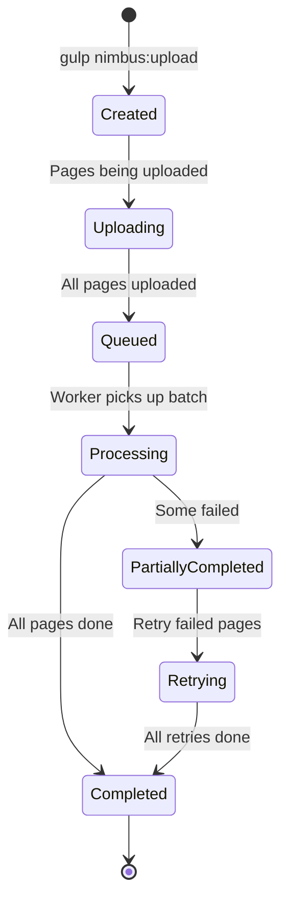

# 📦 Batch Management Specification

## 🎯 **Purpose**

Manage batch creation, tracking, and lifecycle for processing multiple pages as cohesive units with proper status tracking and summary statistics.

## 📊 **Batch Lifecycle**



## 🛠️ **Batch Operations**

### **Create Batch**
```bash
# Auto-create new batch
gulp nimbus:upload --folder=.nimbus/maps

# Continue existing batch
gulp nimbus:upload --folder=.nimbus/maps --batch=batch_20240902_134500
```

### **Monitor Batch**
```bash
# Check batch status
gulp nimbus:batch:status --batch=batch_20240902_134500

# List all batches for project
gulp nimbus:batch:list

# Get detailed batch report
gulp nimbus:batch:report --batch=batch_20240902_134500
```

### **Manage Batch**
```bash
# Retry failed pages in batch
gulp nimbus:batch:retry --batch=batch_20240902_134500

# Cancel batch processing
gulp nimbus:batch:cancel --batch=batch_20240902_134500
```

## 🔧 **Implementation**

### **Batch Status Manager**
```javascript
// gulp/tasks/cloudflare/batch-status.js
const { kvClient } = require('./kv-client');
const chalk = require('chalk');

module.exports = {
  async checkStatus(options) {
    const { batch: batchId } = options;
    const projectConfig = await this.loadProjectConfig();
    
    if (!batchId) {
      // List all batches
      return this.listBatches(projectConfig.project_id);
    }
    
    // Get specific batch status
    const batch = await kvClient.get(
      `batch:${projectConfig.project_id}:${batchId}`,
      'json'
    );
    
    if (!batch) {
      console.error(chalk.red(`❌ Batch not found: ${batchId}`));
      return;
    }
    
    // Display status
    this.displayBatchStatus(batch);
    
    // If still processing, show progress
    if (batch.status === 'processing') {
      await this.showProgress(projectConfig.project_id, batch);
    }
    
    return batch;
  },

  displayBatchStatus(batch) {
    console.log(chalk.blue('\n📦 Batch Status'));
    console.log(chalk.gray('─'.repeat(50)));
    console.log(`ID: ${chalk.cyan(batch.batch_id)}`);
    console.log(`Status: ${this.getStatusEmoji(batch.status)} ${batch.status}`);
    console.log(`Created: ${new Date(batch.created).toLocaleString()}`);
    console.log(`Pages: ${batch.page_count}`);
    
    console.log(chalk.blue('\n📊 Summary'));
    console.log(chalk.gray('─'.repeat(50)));
    console.log(`✅ Completed: ${chalk.green(batch.summary.completed)}`);
    console.log(`❌ Failed: ${chalk.red(batch.summary.failed)}`);
    console.log(`⏳ Pending: ${chalk.yellow(batch.summary.pending)}`);
    
    if (batch.summary.average_time_ms) {
      console.log(`⚡ Avg Time: ${batch.summary.average_time_ms}ms`);
    }
  },

  async showProgress(projectId, batch) {
    const pageIds = Object.keys(batch.pages);
    const statuses = await Promise.all(
      pageIds.map(pageId => 
        kvClient.get(`status:${projectId}:${pageId}`, 'json')
      )
    );
    
    // Count by status
    const statusCounts = statuses.reduce((acc, status) => {
      acc[status.status] = (acc[status.status] || 0) + 1;
      return acc;
    }, {});
    
    // Show progress bar
    const completed = statusCounts.done || 0;
    const total = pageIds.length;
    const percentage = Math.round((completed / total) * 100);
    
    console.log(chalk.blue('\n📈 Progress'));
    console.log(chalk.gray('─'.repeat(50)));
    this.drawProgressBar(percentage);
    console.log(`${completed}/${total} pages (${percentage}%)`);
    
    // Show current processing
    const processing = statuses.filter(s => s.status === 'processing');
    if (processing.length > 0) {
      console.log(chalk.yellow(`\n⚙️  Currently processing ${processing.length} pages...`));
    }
  },

  drawProgressBar(percentage) {
    const width = 40;
    const filled = Math.round((percentage / 100) * width);
    const empty = width - filled;
    
    const bar = '█'.repeat(filled) + '░'.repeat(empty);
    console.log(`[${bar}]`);
  },

  getStatusEmoji(status) {
    const emojis = {
      'uploading': '📤',
      'queued': '📋',
      'processing': '⚙️',
      'completed': '✅',
      'failed': '❌',
      'partially_completed': '⚠️'
    };
    return emojis[status] || '❓';
  }
};
```

### **Batch Report Generator**
```javascript
// gulp/tasks/cloudflare/batch-report.js
module.exports = {
  async generateReport(options) {
    const { batch: batchId } = options;
    const projectConfig = await this.loadProjectConfig();
    
    // Load batch data
    const batch = await kvClient.get(
      `batch:${projectConfig.project_id}:${batchId}`,
      'json'
    );
    
    if (!batch) {
      throw new Error(`Batch not found: ${batchId}`);
    }
    
    // Generate detailed report
    const report = {
      batch_id: batchId,
      status: batch.status,
      summary: batch.summary,
      pages: []
    };
    
    // Get details for each page
    for (const [pageId, pageStatus] of Object.entries(batch.pages)) {
      const status = await kvClient.get(
        `status:${projectConfig.project_id}:${pageId}`,
        'json'
      );
      
      const logs = await kvClient.get(
        `logs:${projectConfig.project_id}:${pageId}`,
        'json'
      );
      
      report.pages.push({
        page_id: pageId,
        status: status.status,
        uploaded: pageStatus.uploaded,
        completed: status.result?.completed,
        changes: status.result?.changes,
        confidence: status.result?.confidence,
        error: status.error?.message,
        log_entries: logs?.entries.length || 0
      });
    }
    
    // Save report
    const reportPath = `.nimbus/reports/batch_${batchId}_report.json`;
    await fs.ensureDir('.nimbus/reports');
    await fs.writeJson(reportPath, report, { spaces: 2 });
    
    console.log(chalk.green(`\n✅ Report saved to: ${reportPath}`));
    
    // Display summary
    this.displayReportSummary(report);
    
    return report;
  },

  displayReportSummary(report) {
    console.log(chalk.blue('\n📊 Batch Report Summary'));
    console.log(chalk.gray('─'.repeat(50)));
    
    // Success rate
    const successRate = (report.summary.completed / report.pages.length * 100).toFixed(1);
    console.log(`Success Rate: ${chalk.green(successRate + '%')}`);
    
    // Average confidence
    const avgConfidence = report.pages
      .filter(p => p.confidence)
      .reduce((sum, p) => sum + p.confidence, 0) / report.summary.completed;
    console.log(`Avg Confidence: ${chalk.cyan(avgConfidence.toFixed(2))}`);
    
    // Total changes
    const totalChanges = report.pages
      .reduce((sum, p) => sum + (p.changes || 0), 0);
    console.log(`Total Changes: ${chalk.yellow(totalChanges)}`);
    
    // Failed pages
    if (report.summary.failed > 0) {
      console.log(chalk.red('\n❌ Failed Pages:'));
      report.pages
        .filter(p => p.status === 'failed')
        .forEach(p => {
          console.log(`  - ${p.page_id}: ${p.error}`);
        });
    }
  }
};
```

### **Batch Retry Logic**
```javascript
// gulp/tasks/cloudflare/batch-retry.js
module.exports = {
  async retryFailed(options) {
    const { batch: batchId } = options;
    const projectConfig = await this.loadProjectConfig();
    
    // Load batch data
    const batch = await kvClient.get(
      `batch:${projectConfig.project_id}:${batchId}`,
      'json'
    );
    
    // Find failed pages
    const failedPages = Object.entries(batch.pages)
      .filter(([pageId, info]) => info.status === 'failed')
      .map(([pageId]) => pageId);
    
    if (failedPages.length === 0) {
      console.log(chalk.green('✅ No failed pages to retry'));
      return;
    }
    
    console.log(chalk.yellow(`\n🔄 Retrying ${failedPages.length} failed pages...`));
    
    // Re-queue failed pages
    for (const pageId of failedPages) {
      await this.requeuePage(projectConfig.project_id, pageId, batchId);
      console.log(`  ↻ Re-queued: ${pageId}`);
    }
    
    // Update batch status
    batch.status = 'processing';
    batch.summary.pending += failedPages.length;
    batch.summary.failed = 0;
    
    await kvClient.put(
      `batch:${projectConfig.project_id}:${batchId}`,
      JSON.stringify(batch)
    );
    
    console.log(chalk.green(`\n✅ Re-queued ${failedPages.length} pages for retry`));
  },

  async requeuePage(projectId, pageId, batchId) {
    // Update status
    await kvClient.put(
      `status:${projectId}:${pageId}`,
      JSON.stringify({
        status: 'queued',
        batch_id: batchId,
        updated: new Date().toISOString()
      })
    );
    
    // Add back to queue with higher priority
    const queue = await kvClient.get(`queue:${projectId}`, 'json') || { items: [] };
    
    // Remove if already in queue
    queue.items = queue.items.filter(item => item.page_id !== pageId);
    
    // Add with higher priority
    queue.items.push({
      page_id: pageId,
      batch_id: batchId,
      priority: 8,  // Higher priority for retries
      queued_at: new Date().toISOString(),
      attempts: 1  // Track retry attempt
    });
    
    await kvClient.put(`queue:${projectId}`, JSON.stringify(queue));
  }
};
```

### **Batch Monitoring Dashboard**
```javascript
// gulp/tasks/cloudflare/batch-monitor.js
module.exports = {
  async monitor(options) {
    const { batch: batchId, interval = 5000 } = options;
    const projectConfig = await this.loadProjectConfig();
    
    console.log(chalk.blue('📊 Monitoring batch...'));
    console.log(chalk.gray('Press Ctrl+C to stop\n'));
    
    let lastStatus = null;
    
    const checkStatus = async () => {
      const batch = await kvClient.get(
        `batch:${projectConfig.project_id}:${batchId}`,
        'json'
      );
      
      // Clear console for fresh display
      console.clear();
      
      // Display header
      console.log(chalk.blue('📊 Batch Monitor'));
      console.log(chalk.gray('─'.repeat(50)));
      console.log(`Batch: ${chalk.cyan(batchId)}`);
      console.log(`Updated: ${new Date().toLocaleTimeString()}`);
      
      // Display status
      this.displayBatchStatus(batch);
      
      // Check if status changed
      if (batch.status !== lastStatus) {
        if (batch.status === 'completed') {
          console.log(chalk.green('\n🎉 Batch completed!'));
          process.exit(0);
        }
        lastStatus = batch.status;
      }
      
      // Show live updates
      if (batch.status === 'processing') {
        await this.showLiveProgress(projectConfig.project_id, batch);
      }
    };
    
    // Initial check
    await checkStatus();
    
    // Set up interval
    setInterval(checkStatus, interval);
  },

  async showLiveProgress(projectId, batch) {
    // Get currently processing pages
    const processing = [];
    
    for (const [pageId, info] of Object.entries(batch.pages)) {
      const status = await kvClient.get(
        `status:${projectId}:${pageId}`,
        'json'
      );
      
      if (status.status === 'processing') {
        processing.push({
          page_id: pageId,
          step: status.processing?.current_step,
          progress: status.processing?.progress
        });
      }
    }
    
    if (processing.length > 0) {
      console.log(chalk.yellow('\n⚙️  Currently Processing:'));
      processing.forEach(p => {
        const progressBar = this.miniProgressBar(p.progress || 0);
        console.log(`  ${p.page_id}: ${p.step} ${progressBar}`);
      });
    }
  },

  miniProgressBar(percentage) {
    const width = 20;
    const filled = Math.round((percentage / 100) * width);
    const empty = width - filled;
    return `[${chalk.green('▓'.repeat(filled))}${chalk.gray('░'.repeat(empty))}] ${percentage}%`;
  }
};
```

## 📊 **Batch Analytics**

### **Performance Metrics**
```javascript
async function calculateBatchMetrics(batch) {
  const metrics = {
    total_pages: batch.page_count,
    success_rate: (batch.summary.completed / batch.page_count) * 100,
    average_time_ms: batch.summary.average_time_ms,
    total_changes: 0,
    average_confidence: 0
  };
  
  // Calculate from page results
  const completedPages = Object.entries(batch.pages)
    .filter(([_, info]) => info.status === 'done');
  
  for (const [pageId, _] of completedPages) {
    const status = await kvClient.get(`status:${projectId}:${pageId}`, 'json');
    metrics.total_changes += status.result?.changes || 0;
    metrics.average_confidence += status.result?.confidence || 0;
  }
  
  metrics.average_confidence /= completedPages.length;
  
  return metrics;
}
```

## ✅ **Success Criteria**

- [ ] Create and track batches with unique IDs
- [ ] Monitor batch progress in real-time
- [ ] Generate comprehensive batch reports
- [ ] Support retry logic for failed pages
- [ ] Display live monitoring dashboard
- [ ] Calculate batch performance metrics
- [ ] Handle batch lifecycle states
- [ ] Provide clear status visualization
