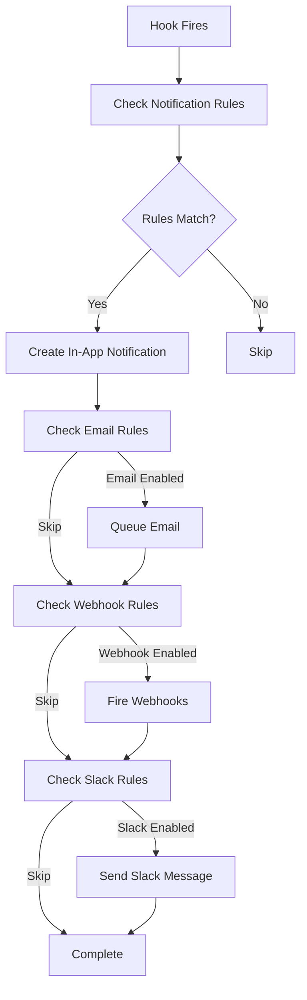

# 🔔 Notifications Framework Specification

## 🎯 **Big Picture Vision**

Build a **comprehensive notification system** that handles:
- ✅ **In-app notifications** (dashboard dropdown)
- ✅ **Email notifications** (MailerSend integration)
- ✅ **Webhook notifications** (external system integrations)
- ✅ **Slack notifications** (team collaboration)

**Key Insight:** This isn't just for NimbusAI - **AIVERIE needs this too** for watch processing workflows!

## 🏗️ **Architecture Overview**

### **Core Models**
```javascript
// 1. NotificationModel - In-app notifications
{
  notification_id: 'notif_abc123',
  user_id: 'user_123',
  project_id: 'project_456', // Optional
  type: 'batch_upload_complete',
  title: 'Upload Complete',
  message: '15 pages uploaded successfully',
  metadata: { pages_count: 15, batch_id: 'batch_789' },
  seen: false,
  expires_at: '2024-01-15T10:00:00Z',
  created_at: '2024-01-08T10:00:00Z'
}

// 2. WebhookModel - External integrations
{
  webhook_id: 'webhook_abc123',
  project_id: 'project_456',
  user_id: 'user_123',
  name: 'AIVERIE Processing Complete',
  url: 'https://aiverie.com/api/webhooks/nimbus',
  secret: 'webhook_secret_key',
  events: ['page.completed', 'batch.completed'],
  active: true,
  retry_count: 3,
  created_at: '2024-01-08T10:00:00Z'
}

// 3. NotificationRuleModel - What triggers what
{
  rule_id: 'rule_abc123',
  project_id: 'project_456', // Optional - can be global
  user_id: 'user_123',
  event_type: 'page.completed',
  channels: {
    in_app: true,
    email: true,
    slack: false,
    webhook: true
  },
  conditions: {
    min_pages: 5, // Only notify for batches > 5 pages
    status: 'completed'
  },
  active: true
}
```

## 🔄 **Notification Flow**



## 🛠️ **Implementation Plan**

### **Phase 1: Core Notification System** (Day 1-2)
- [ ] **NotificationModel** - D1 table + DataModel
- [ ] **Notification CloudFunctions** (create, list, mark_seen, dismiss)
- [ ] **Enhanced AuditLogger** - Add notification creation
- [ ] **Frontend dropdown** - Update navbar notification center

### **Phase 2: Email Integration** (Day 2-3)
- [ ] **MailerSend module** - Email sending service
- [ ] **Email templates** - Use your paid SaaS templates!
- [ ] **Email CloudFunctions** - Send welcome, reset, notification emails
- [ ] **Email queue system** - Reliable delivery

### **Phase 3: Webhook System** (Day 3-4)
- [ ] **WebhookModel** - Store webhook configurations
- [ ] **Webhook CloudFunctions** - CRUD operations
- [ ] **Webhook delivery system** - Reliable firing with retries
- [ ] **Webhook security** - HMAC signatures

### **Phase 4: Notification Rules** (Day 4-5)
- [ ] **NotificationRuleModel** - Flexible rule engine
- [ ] **Rule evaluation system** - When to fire what
- [ ] **Frontend rule management** - User-friendly configuration
- [ ] **Default rules** - Sensible out-of-the-box behavior

### **Phase 5: Integration & Polish** (Day 5-6)
- [ ] **Slack integration** - Webhook-based Slack messages
- [ ] **Notification preferences** - User settings
- [ ] **Batch operations** - Test with page uploads
- [ ] **AIVERIE integration** - Watch processing notifications

## 📊 **DataModel Definitions**

### **NotificationModel** 
```javascript
// cf-platform/src/models/notification.js
const { DataModel } = require('../modules/datamodel/core/datamodel');

class NotificationModel extends DataModel {
  static get tableName() { return 'notifications'; }
  static get primaryKey() { return 'notification_id'; }
  
  static get schema() {
    return {
      notification_id: { type: 'string', required: true, primaryKey: true },
      user_id: { type: 'string', required: true },
      project_id: { type: 'string', required: false },
      type: { type: 'string', required: true },
      title: { type: 'string', required: true },
      message: { type: 'string', required: true },
      metadata: { type: 'object', required: false, default: {} },
      seen: { type: 'boolean', required: false, default: false },
      expires_at: { type: 'string', required: false },
      created_at: { type: 'string', required: true },
      updated_at: { type: 'string', required: false }
    };
  }
  
  static get hooks() {
    return {
      beforeCreate: async (instance, context) => {
        // Auto-generate ID and timestamps
        if (!instance.get('notification_id')) {
          instance.set('notification_id', `notif_${Date.now()}_${Math.random().toString(36).substr(2, 9)}`);
        }
        instance.set('created_at', new Date().toISOString());
      }
    };
  }
}

// Register the model
NotificationModel.register();
module.exports = NotificationModel;
```

### **WebhookModel**
```javascript
// cf-platform/src/models/webhook.js
const { DataModel } = require('../modules/datamodel/core/datamodel');

class WebhookModel extends DataModel {
  static get tableName() { return 'webhooks'; }
  static get primaryKey() { return 'webhook_id'; }
  
  static get schema() {
    return {
      webhook_id: { type: 'string', required: true, primaryKey: true },
      project_id: { type: 'string', required: false },
      user_id: { type: 'string', required: true },
      name: { type: 'string', required: true },
      url: { type: 'string', required: true },
      secret: { type: 'string', required: true },
      events: { type: 'array', required: true, default: [] },
      active: { type: 'boolean', required: false, default: true },
      retry_count: { type: 'number', required: false, default: 3 },
      created_at: { type: 'string', required: true },
      updated_at: { type: 'string', required: false }
    };
  }
  
  static get hooks() {
    return {
      beforeCreate: async (instance, context) => {
        if (!instance.get('webhook_id')) {
          instance.set('webhook_id', `webhook_${Date.now()}_${Math.random().toString(36).substr(2, 9)}`);
        }
        instance.set('created_at', new Date().toISOString());
        
        // Generate webhook secret if not provided
        if (!instance.get('secret')) {
          instance.set('secret', `whsec_${Math.random().toString(36).substr(2, 32)}`);
        }
      }
    };
  }
}

WebhookModel.register();
module.exports = WebhookModel;
```

### **NotificationRuleModel**
```javascript
// cf-platform/src/models/notification-rule.js
const { DataModel } = require('../modules/datamodel/core/datamodel');

class NotificationRuleModel extends DataModel {
  static get tableName() { return 'notification_rules'; }
  static get primaryKey() { return 'rule_id'; }
  
  static get schema() {
    return {
      rule_id: { type: 'string', required: true, primaryKey: true },
      project_id: { type: 'string', required: false },
      user_id: { type: 'string', required: true },
      event_type: { type: 'string', required: true },
      channels: { type: 'object', required: true, default: { in_app: true } },
      conditions: { type: 'object', required: false, default: {} },
      active: { type: 'boolean', required: false, default: true },
      created_at: { type: 'string', required: true },
      updated_at: { type: 'string', required: false }
    };
  }
  
  static get hooks() {
    return {
      beforeCreate: async (instance, context) => {
        if (!instance.get('rule_id')) {
          instance.set('rule_id', `rule_${Date.now()}_${Math.random().toString(36).substr(2, 9)}`);
        }
        instance.set('created_at', new Date().toISOString());
      }
    };
  }
}

NotificationRuleModel.register();
module.exports = NotificationRuleModel;
```

## 🔧 **Key Components**

### **Enhanced AuditLogger**
```javascript
// cf-platform/src/modules/logs/core/audit-logger.js
class AuditLogger {
  async logWithNotification(logData, notificationData) {
    // 1. Create audit log (existing functionality)
    await this.log(logData);
    
    // 2. Check notification rules
    const rules = await this.getNotificationRules(logData.event_type);
    
    // 3. Fire notifications based on rules
    for (const rule of rules) {
      if (this.evaluateRule(rule, logData)) {
        await this.fireNotifications(rule, notificationData);
      }
    }
  }
  
  async fireNotifications(rule, data) {
    const { channels } = rule;
    
    if (channels.in_app) await this.createInAppNotification(data);
    if (channels.email) await this.queueEmail(data);
    if (channels.webhook) await this.fireWebhooks(data);
    if (channels.slack) await this.sendSlack(data);
  }
}
```

### **MailerSend Integration**
```javascript
// cf-platform/src/modules/email/mailersend.js
class MailerSendService {
  async sendWelcomeEmail(user) {
    return await this.send({
      template_id: 'welcome_template',
      to: user.email,
      variables: { name: user.name }
    });
  }
  
  async sendNotificationEmail(notification) {
    return await this.send({
      template_id: 'notification_template',
      to: notification.user_email,
      variables: {
        title: notification.title,
        message: notification.message,
        action_url: notification.action_url
      }
    });
  }
}
```

### **Webhook Delivery System**
```javascript
// cf-platform/src/modules/webhooks/delivery.js
class WebhookDelivery {
  async fireWebhook(webhook, eventData) {
    const payload = {
      event: eventData.type,
      data: eventData,
      timestamp: new Date().toISOString()
    };
    
    const signature = this.generateSignature(payload, webhook.secret);
    
    try {
      await fetch(webhook.url, {
        method: 'POST',
        headers: {
          'Content-Type': 'application/json',
          'X-Nimbus-Signature': signature
        },
        body: JSON.stringify(payload)
      });
    } catch (error) {
      // Retry logic with exponential backoff
      await this.scheduleRetry(webhook, payload, error);
    }
  }
}
```

## 🎯 **MVP Feature Set**

### **Must-Have (Week 1)**
- ✅ In-app notifications dropdown
- ✅ Basic email notifications (welcome, reset)
- ✅ Simple webhook firing
- ✅ Page upload completion notifications

### **Nice-to-Have (Week 2)**
- ✅ Advanced notification rules
- ✅ Slack integration
- ✅ Email templates (your paid ones!)
- ✅ Webhook retry logic

### **Future Enhancements**
- 📱 Push notifications (mobile)
- 📊 Notification analytics
- 🎨 Custom email templates
- 🔄 Webhook testing tools

## 🚀 **Integration Points**

### **Page Upload Workflow**
```javascript
// When batch upload completes
await auditLogger.logWithNotification(
  {
    action: 'batch_upload_complete',
    entity_type: 'project',
    entity_id: projectId,
    user_id: auth.user_id,
    message: `Batch upload completed: ${pageCount} pages`
  },
  {
    type: 'batch_upload_complete',
    title: 'Upload Complete! 🎉',
    message: `Successfully uploaded ${pageCount} pages to ${projectName}`,
    action_url: `/app/project.html#${projectId}`
  }
);
```

### **AIVERIE Watch Processing**
```javascript
// When watch analysis completes
await auditLogger.logWithNotification(
  {
    action: 'watch_analysis_complete',
    entity_type: 'watch',
    entity_id: watchId,
    user_id: auth.user_id,
    message: 'Watch analysis completed with valuation'
  },
  {
    type: 'watch_analysis_complete',
    title: 'Analysis Complete! ⌚',
    message: `Your ${watchBrand} analysis is ready with estimated value`,
    action_url: `/watch/${watchId}/results`
  }
);
```

## 📋 **Success Criteria**

### **Technical**
- [ ] Notifications appear in dropdown within 5 seconds
- [ ] Emails deliver within 30 seconds
- [ ] Webhooks fire with 99.9% reliability
- [ ] System handles 1000+ notifications/hour

### **User Experience**
- [ ] Clear, actionable notification messages
- [ ] Easy notification management (mark read, dismiss)
- [ ] Sensible default notification preferences
- [ ] No notification spam (smart batching)

## 🔗 **Related TODOs**

This spec connects to these implementation tasks:
- [ ] **TODO-001**: Create NotificationModel and D1 migration
- [ ] **TODO-002**: Build notification CloudFunctions
- [ ] **TODO-003**: Update frontend notification dropdown
- [ ] **TODO-004**: Integrate MailerSend service
- [ ] **TODO-005**: Implement webhook delivery system
- [ ] **TODO-006**: Create notification rules engine
- [ ] **TODO-007**: Add notification triggers to existing hooks
- [ ] **TODO-008**: Test with page upload workflow
- [ ] **TODO-009**: Test with AIVERIE integration
- [ ] **TODO-010**: Polish and deploy

---

## 🎯 **NEXT STEPS**

**Ready to start with Phase 1?** 
1. Create the NotificationModel
2. Build basic CloudFunctions  
3. Update the frontend dropdown
4. Test with a simple notification

**This foundation will unlock both NimbusAI page uploads AND AIVERIE watch processing notifications!** 🚀
